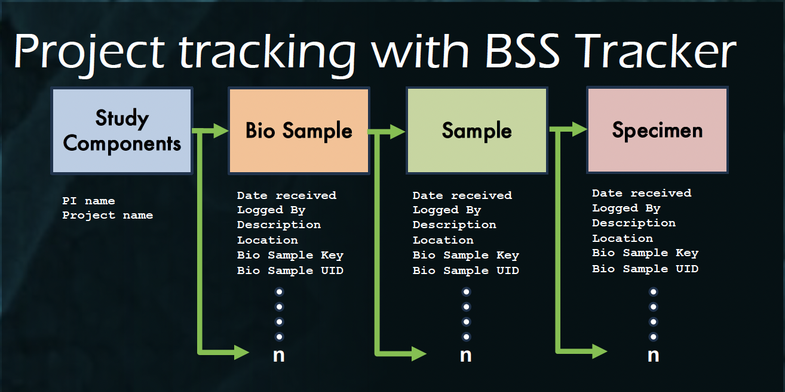
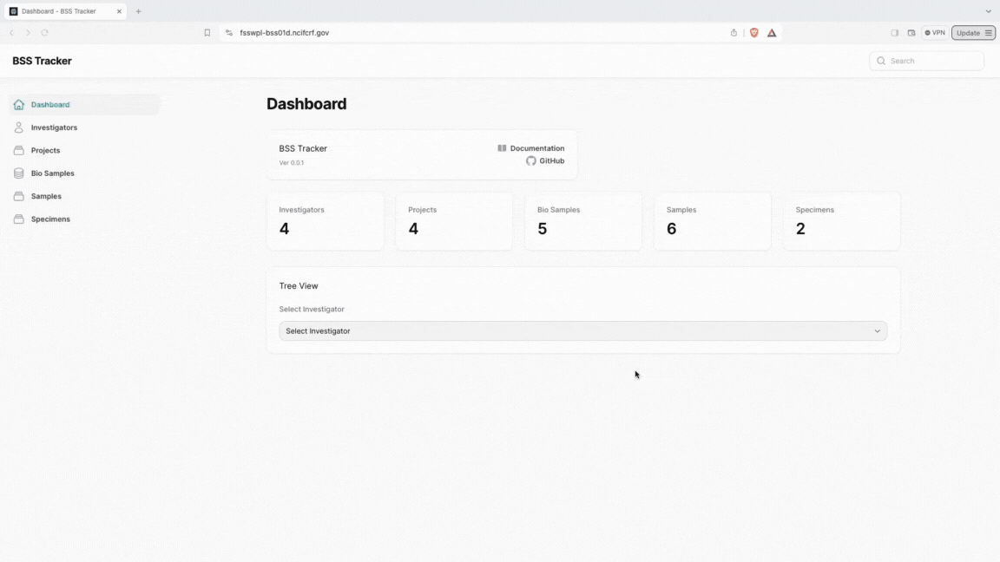

# BSS Tracker

## Description

The BSS Tracker is a project tracking tool that connects biological samples and specimens to projects and investigators. 

Overview of Dashboard and treeview of sample project and it's connected samples: 

Overview of the entry fields and an example of a bio-specimen entry:

## Requirements

- A web server (Apache/NGINX)
- PHP (>= 8.1)
- A database server
  - MariaDB (10.10+)
  - MySQL (5.7+)
  - PostgreSQL (11.0+)
  - SQLite (3.8.8+)
  - SQL Server (2017+)
- Composer (https://getcomposer.org)
- NodeJS (NPM/Yarn for asset bundling)

BSS Tracker uses Laravel as it's PHP Framework. For further detailed instructions on setting up the system (including possible requirements not listed here) please visit the [Laravel Documentation](https://laravel.com/docs/10.x/).

## Getting Setup

Once you've cloned the repository, you'll need to install composer dependencies

    composer install

Then, you'll need to install & build the front-end assets

    npm i && npm run build

If you plan on developing the application, you should instead run

    npm i && npm run dev

Next, you'll copy the `.env.example` file to `.env`

    cp .env.example .env

Finally, you'll need to set the application encryption key

    php artisan key:generate

## Deployment

As BSS Tracker is built using Laravel, deployment instructions are identical to those of Laravel. For help getting the application up & running, refer to the [Laravel Deployment Documentation](https://laravel.com/docs/10.x/deployment). 

## Front-end assets

Once Laravel is setup (including Composer dependencies), you must build the front-end assets. You can accomplish this by running the `npm run build` command in the root directory of the application.

## Installation

Once all of the above steps have been completed, you should now be able to navigate to the application URL & follow the web-based installation instructions.
